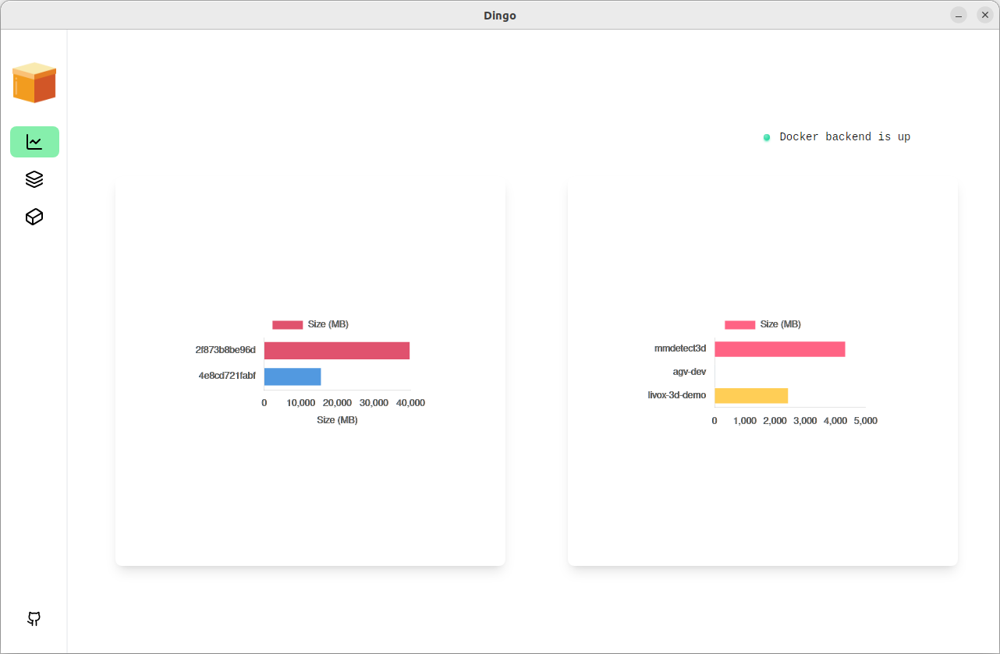
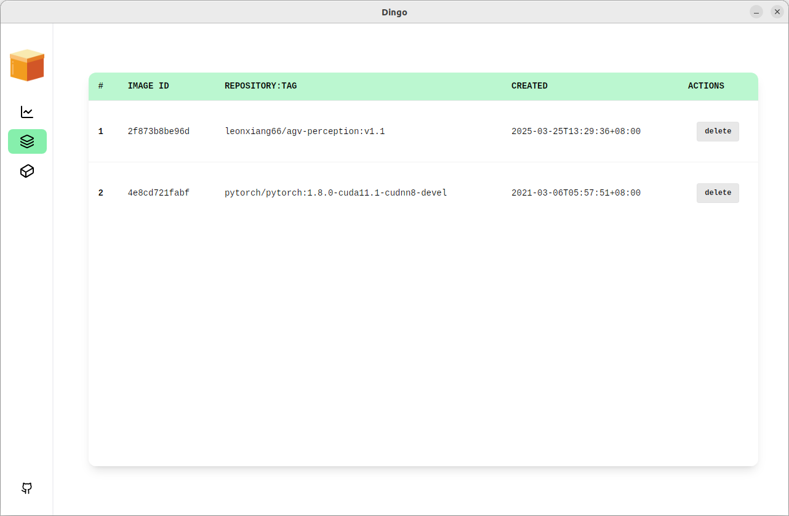
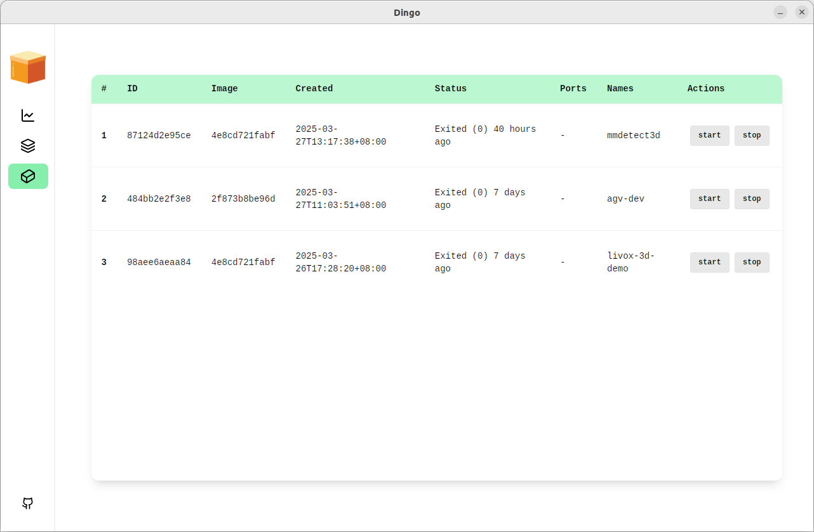

# Dingo Application

Written with [Wails](https://github.com/wailsapp/wails) framework.
- Frontend: 
    -  Svelte
    -  Tailwind CSS
    -  DaisyUI
    -  Chart.js
- Backend:
    -  Go

# App Screenshots

